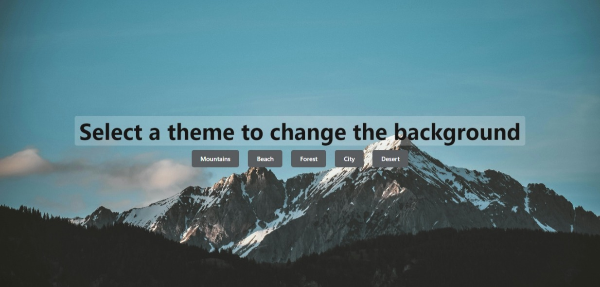

# Background Changing App (React)

**Description**:  
The Background Changing Theme App is a fun and interactive app built with React that allows users to change the background theme of the page with just a click. It provides multiple themes to choose from, enhancing the visual experience while being simple and responsive.

**Tech Stack**: React

**Features**:
- Users can change the background theme by clicking buttons.
- Multiple themes to choose from, providing a dynamic visual experience.
- Fully responsive and mobile-friendly design.
- Simple and clean user interface with smooth transitions.

**Deployed Link**:  
You can check out the live version of the Background Changing Theme App here: [Background Theme App Live](https://background-change-chi.vercel.app/).

